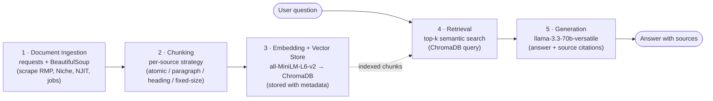

# Project 1 Planning: The Unofficial Guide

> Write this document before you write any pipeline code.
> Your spec and architecture diagram are what you'll use to direct AI tools (Claude, Copilot, etc.) to generate your implementation — the more specific they are, the more useful the generated code will be.
> Update the Retrieval Approach and Chunking Strategy sections if you change your approach during implementation.
> Update this file before starting any stretch features.

---

## Domain

<!-- What domain did you choose? Why is this knowledge valuable and hard to find through official channels? -->

This system covers the full unofficial student experience at NJIT — the practical, on-the-ground knowledge that incoming freshmen need to actually navigate college life. 

Incoming freshmen don't need another brochure — they need honest answers to questions like "Is Cypress Hall worth it or should I try to get into Martinson?" or "Is Professor X actually as tough as people say?"

Demo Questions-
     1. Is on-campus housing at NJIT worth it for freshmen?
     2. Which professors get the best reviews for CS courses?
     3. How does dining work and is the meal plan required?
     4. What's it like living in Harrison vs. on campus?
     5. What do students say about internship and career outcomes?
---

## Document Sources

| # | Source | Type | URL or file path |
|---|--------|------|-----------------|
| 1 | Rate My Professors — NJIT School Page | Student reviews (professor ratings) | https://www.ratemyprofessors.com/school/668 |
| 2 | Niche — NJIT General Reviews | Student reviews (overall experience) | https://www.niche.com/colleges/new-jersey-institute-of-technology/reviews/ |
| 3 | Niche — NJIT Academics Page | Student reviews (courses & faculty) | https://www.niche.com/colleges/new-jersey-institute-of-technology/academics/ |
| 4 | Niche — NJIT Campus Life Page | Student reviews + survey data (dorms, food, safety, social) | https://www.niche.com/colleges/new-jersey-institute-of-technology/campus-life/ |
| 5 | Niche — NJIT Graduate Reviews | Student reviews (grad student perspective) | https://www.niche.com/graduate-schools/new-jersey-institute-of-technology/reviews/ |
| 6 | NJIT Official Residence Halls Page | Official documentation (dorm options & amenities) | https://www.njit.edu/life/residence-halls |
| 7 | NJIT Residence Life FAQ | Official documentation (housing policy & procedures) | https://www.njit.edu/reslife/faq.php |
| 8 | NJIT Career Development Services | Official documentation (internships, Handshake, career fairs) | https://www.njit.edu/careerservices/ |
| 9 | Patch — "Inside Colleges: NJIT" | Journalistic/community perspective (campus overview, safety, Newark context) | https://patch.com/new-jersey/bridgewater/bp--inside-colleges-new-jersey-institute-of-technology |
| 10 | NJIT Meal Plan | Official Documentation | https://www.njit.edu/reslife/meal-plan-rates |
| 11 | NJIT Room Cost | Official Documentation | https://www.njit.edu/reslife/rates.php |

---

## Chunking Strategy

<!-- How will you split documents into chunks?
     State your chunk size (in tokens or characters), overlap size, and explain why those
     numbers fit the structure of your documents.
     A review-heavy corpus warrants different chunking than a long FAQ. -->

Our corpus is heterogeneous, so we use a **per-source chunking strategy** rather than one global setting.

**Chunk size (by source):**

- **Rate My Professors → one review = one chunk.** Each professor review is already an atomic unit. Don't merge them, don't split them. Tag each chunk with metadata: `professor_name`, `department`, `rating`, `difficulty`.
- **Niche (rankings, campus reviews) → sentence/paragraph chunking.** Niche mixes stats with prose. Split on paragraph boundaries. Keep stat blocks (e.g. "Housing rated 4.2/5") as their own chunk — they answer different questions than prose reviews.
- **NJIT Housing / Policy pages → structure-aware (Markdown/HTML heading-based) chunking.** These pages have clear sections — "Application Process", "Room Types", "Costs". Chunk by heading so a question like "how do I apply for on-campus housing?" retrieves exactly the right section.
- **Job postings → fixed-size with overlap (512 tokens, ~50 token overlap).** Job descriptions are dense and semi-structured. Fixed-size works fine here since students are doing keyword-style searches ("software internship", "on-campus job").

**Overlap:** ~50 tokens for fixed-size job postings. The atomic (one-review), paragraph, and heading-based strategies use natural boundaries and need no overlap.

**Reasoning:** A review-heavy corpus warrants different chunking than a long FAQ. Reviews are short and self-contained, so splitting them destroys meaning; policy pages are hierarchical, so heading boundaries map cleanly to user questions; job postings are dense and keyword-searched, so fixed-size with light overlap avoids cutting key phrases across chunk boundaries.

**Metadata (attached to every chunk regardless of strategy):**

```json
{
  "source": "rate_my_professor",
  "professor": "Dr. Smith",
  "department": "Computer Science",
  "rating": 4.2,
  "url": "https://...",
  "content_type": "review"
}
```

`content_type` is one of `review | policy | ranking | job`.

---

## Retrieval Approach

<!-- Which embedding model are you using (e.g., all-MiniLM-L6-v2 via sentence-transformers)?
     How many chunks will you retrieve per query (top-k)?
     If you were deploying this for real users and cost wasn't a constraint, what tradeoffs
     would you weigh in choosing a different embedding model — context length, multilingual
     support, accuracy on domain-specific text, latency? -->

**Embedding model:** `all-MiniLM-L6-v2` via `sentence-transformers`. It's fast, runs locally with no API cost, and its 384-dim embeddings are strong on short, opinion-based text — which is most of our corpus (reviews). Its ~256-token input window comfortably fits a single professor review or a paragraph chunk.

**Top-k:** **k = 5**. Most of our chunks are short reviews, so one chunk rarely tells the whole story — pulling 5 lets the LLM see a *consensus* across students ("multiple reviewers mention…") instead of over-trusting one opinion. Too few (k=1–2) risks missing the majority view or surfacing an outlier; too many (k=10+) floods the prompt with weakly-related chunks, dilutes the signal, and raises token cost/latency. We'll start at 5 and tune against the Evaluation Plan questions.

**Production tradeoff reflection:** If cost weren't a constraint, I'd weigh moving to a larger embedding model (e.g. OpenAI `text-embedding-3-large` or a BGE/E5 model) against a few axes:
- **Accuracy on domain-specific text** — bigger models capture more nuance in slangy student reviews ("the curve is brutal but fair"), which `all-MiniLM` can flatten.
- **Context length** — our policy and job-posting chunks can exceed MiniLM's ~256-token window and get truncated; a longer-context model would embed them whole.
- **Multilingual support** — some Collegedunia reviews come from international students; a multilingual model (e.g. `paraphrase-multilingual-MiniLM`) would handle non-English text the current model treats as noise.
- **Latency & throughput** — MiniLM is sub-millisecond locally; an API model adds network round-trips and rate limits, which matters at scale but not for this project.

For this project, MiniLM's speed and zero cost win. In production with real users, I'd likely move to a larger-context, domain-tuned model and accept the added latency/cost for better retrieval on policy pages and multilingual reviews.

---

## Evaluation Plan

<!-- List your 5 test questions with their expected correct answers.
     Questions should be specific enough that you can judge whether the system's response
     is right or wrong. "What are good dining halls?" is too vague.
     "What do students say about wait times at [dining hall name] during lunch?" is testable. -->

| # | Question | Expected answer |
|---|----------|-----------------|
| 1 | How does dining work and is the meal plan required? | NJIT has a food service contract with an independent vendor, which offers well-balanced, nutritious meals with menus that feature traditional hot foods, fast foods, soup and salad bar, deli sandwiches and desserts's. First year and Sophomores (by credit hour) living on campus are required to have a meal plan selecting from plans A-E.  |
| 2 | What do students say about internship and career outcomes? | 67%
of students agree that the alumni network is very strong and 80%
of students feel the career center was helpful in finding them a job or internship.87%
of students feel confident they will find a job in their field after graduation. |
| 3 | How are the academic and recreational facilities at NJIT? | Campus facilities at NJIT include modern resources such as advanced engineering labs, makerspaces with 3D printers, a wellness and events center, and libraries with quiet study areas. While students appreciate these academic and recreational spaces, some note that certain buildings and facilities could benefit from maintenance and upgrades, such as cleaner bathrooms and improved dining options. |
| 4 | What is the cost to live on campus? | Depends on the hall. Per person/semester (2025-2026): a standard Double Room runs roughly $4,949 (Redwood) to $5,313 (Martinson/Greek), about $5,170 on average; private/single rooms and Maple/Talbott apartments cost more ($6,000-$9,548). |
| 5 | How do I look for a job on campus? | Contact or visit the Student Financial Aid Services Office in the Student Mall for information about job opportunities on campus. Residence Life also hires many students. See the Employment Opportunities section for the positions we offer. |

---

## Anticipated Challenges

<!-- What could go wrong? Name at least two specific risks with reasoning.
     Consider: noisy or inconsistent documents, missing source attribution, off-topic
     retrieval, chunks that split key information across boundaries. -->

1. **Inconsistent / missing metadata on scraped reviews.** Rate My Professors and Niche reviews don't always expose a clean department, professor name, or rating in a parseable spot — and our chunking plan leans on that metadata (e.g. filtering CS professors). If fields come back null or mislabeled, metadata-filtered queries like "best-reviewed CS professors" will silently return wrong or empty results. *Mitigation:* validate/normalize metadata at ingestion, default missing fields explicitly (e.g. `department: "unknown"`), and don't hard-fail retrieval on a missing tag.

2. **Off-topic / mixed-source retrieval blurring opinion and policy.** Our corpus mixes subjective reviews with official policy pages. A query like "is the meal plan required?" should pull the official NJIT policy chunk, but semantic search may surface emotionally-worded review chunks that *mention* dining instead — giving an answer that sounds confident but isn't authoritative. *Mitigation:* use `content_type` metadata to bias or filter retrieval toward `policy` chunks for factual/procedural questions, and have the generation step cite its source so a policy claim backed only by a review is visible.

3. **Key facts split across chunk boundaries (cost/policy tables).** Housing cost and policy pages list facts in tables/sections — if a "Room Type → Cost" pair lands in two adjacent chunks, neither chunk alone answers "what does a double room cost?" *Mitigation:* the heading-based (structure-aware) chunking keeps each section intact, and the ~50-token overlap on fixed-size chunks reduces the chance a key fact is cleanly severed at a boundary.

---

## Architecture

<!-- Draw a diagram of your pipeline showing the five stages:
     Document Ingestion → Chunking → Embedding + Vector Store → Retrieval → Generation
     Label each stage with the tool or library you're using.
     You can use ASCII art, a Mermaid diagram, or embed a sketch as an image.
     You'll use this diagram as context when prompting AI tools to implement each stage. -->



**Stage labels / tools:**

| Stage | Tool / Library |
|-------|----------------|
| Document Ingestion | `requests` + `BeautifulSoup` |
| Chunking | per-source strategy (see Chunking Strategy above) |
| Embedding | `all-MiniLM-L6-v2` (sentence-transformers) |
| Vector Store | `ChromaDB` |
| Retrieval | ChromaDB top-k semantic search |
| Generation | `llama-3.3-70b-versatile` |

---

## AI Tool Plan

<!-- For each part of the pipeline below, describe:
     - Which AI tool you plan to use (Claude, Copilot, ChatGPT, etc.)
     - What you'll give it as input (which sections of this planning.md, which requirements)
     - What you expect it to produce
     - How you'll verify the output matches your spec

     "I'll use AI to help me code" is not a plan.
     "I'll give Claude my Chunking Strategy section and ask it to implement chunk_text()
     with my specified chunk size and overlap" is a plan. -->


**Tool:** Claude (in the IDE). For each milestone I'll give it the relevant sections of this `planning.md` as the spec and ask it to generate the required functions — then I verify the output against the test cases below rather than accepting it blindly.

**Milestone 3 — Ingestion and chunking:**
- **Input I'll give Claude:** the **Document Sources** table and the **Chunking Strategy** section (including the per-source rules and metadata schema).
- **Expected output:** a scraper using `requests` + `BeautifulSoup` that pulls each source, plus a `chunk_text()` / per-source chunker that applies the right strategy (one-review = one chunk for RMP, paragraph for Niche, heading-based for NJIT policy, fixed-size 512/~50 overlap for jobs) and attaches the metadata dict to every chunk.
- **How I'll verify:** run it on 1–2 URLs and check that chunks come out at the expected granularity (a single review isn't split/merged), `content_type` is correctly tagged, and no metadata field is silently null.

**Milestone 4 — Embedding and retrieval:**
- **Input I'll give Claude:** the **Retrieval Approach** section (model `all-MiniLM-L6-v2`, top-k = 5) and the chunk/metadata format from Milestone 3.
- **Expected output:** an embedding function using `sentence-transformers`, code to store vectors + metadata in **ChromaDB**, and a `retrieve(query, k=5)` function doing top-k semantic search with optional `content_type` filtering.
- **How I'll verify:** query with my 5 Evaluation Plan questions and confirm the retrieved chunks actually contain the expected answers (e.g. the meal-plan question pulls the policy chunk, not a review).

**Milestone 5 — Generation and interface:**
- **Input I'll give Claude:** the **Architecture** diagram and the retrieval output format from Milestone 4.
- **Expected output:** a generation step that feeds the retrieved chunks to `llama-3.3-70b-versatile` with a prompt that answers the question and cites sources, plus a simple interface (CLI/chat loop) to ask questions.
- **How I'll verify:** run all 5 Evaluation Plan questions end-to-end and compare each answer against its expected answer, checking that sources are cited and no claim is fabricated beyond the retrieved chunks.
